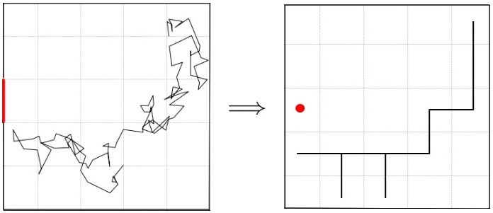

# Narrow_Escape_Problem
#### A Markov chain approach to analyse the Narrow Escape Problem  
More info on the Narrow Escape Problem : https://en.wikipedia.org/wiki/Narrow_escape_problem  
for more information on the code/implementation, feel free to reach out to me at : alexfhill1@gmail.com  
 

